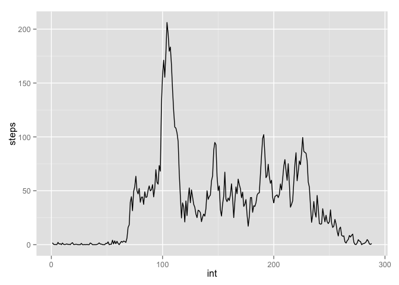

# Reproducible Research: Peer Assessment 1


## Loading and preprocessing the data

```r
unzip('activity.zip')
data = read.csv("activity.csv")
```

## What is mean total number of steps taken per day?

```r
# format the data specifically for this analysis
data2 = data
data2$date = strptime(data2$date, "%Y-%m-%d")
library(lubridate)
data2$day = factor(day(data2$date))

# sum of steps per day
data2 = na.exclude(data2) # delete missing rows 
total_steps = aggregate(data2$steps, list(data2$day), sum)
library(ggplot2)
qplot(total_steps$x, geom="histogram", binwidth = 1000,
      main = "Total steps per day")                  
```

 

```r
mean(total_steps$x, na.rm = T)
```

```
## [1] 19020.27
```

```r
median(total_steps$x, na.rm = T)
```

```
## [1] 20597.5
```

## What is the average daily activity pattern?

```r
data2$interval = factor(data2$interval)
steps_per_int = aggregate(data2$steps, list(data2$interval), mean)
names(steps_per_int) = c("int", "steps")
steps_per_int$int = as.numeric(steps_per_int$int)
p = ggplot(steps_per_int)
p + geom_line(aes(x=int, y=steps))
```

 

```r
int_max_avg_steps = steps_per_int$int[steps_per_int$steps == max(steps_per_int$steps)]
int_max_avg_steps
```

```
## [1] 104
```

## Imputing missing values

```r
sum(is.na(data$steps))
```

```
## [1] 2304
```

```r
data3 = data
data3$date = strptime(data3$date, "%Y-%m-%d")
library(lubridate)
data3$day = day(data3$date)
data3$week = week(data3$date)

# replace with median of day
# if all values for a day are missing, replace with median of week
for (r in 1:length(data3$steps)){
  if( is.na(data3$steps[r]) ){ 
    data3$steps[r] = median(data3$steps[data3$day == data3$day[r]], na.rm=T) 
  }
  if( is.na(data3$steps[r]) ){ 
    data3$steps[r] = median(data3$steps[data3$week == data3$week[r]], na.rm=T) 
  }
}
total_steps2 = aggregate(data3$steps, list(data3$day), sum)
qplot(total_steps2$x, geom="histogram", binwidth = 1000,
      main = "Total steps per day")                  
```

 

```r
mean(total_steps2$x, na.rm = T)
```

```
## [1] 18406.71
```

```r
median(total_steps2$x, na.rm = T)
```

```
## [1] 20525
```
The mean and median are lower after replacing missing values by daily or weekly medians. The histogram looks surprisingly similar.


## Are there differences in activity patterns between weekdays and weekends?

```r
data3$weekday = weekdays(data3$date)
data3$weekend = "weekday"
data3$weekend[data3$weekday %in% c("Saturday", "Sunday")] = "weekend"
data3$weekend = factor(data3$weekend)

# make timecourses
data3$interval = factor(data3$interval)
weekdaydata = data3[data3$weekend == "weekday",]
steps_per_int_wday = aggregate(weekdaydata$steps, list(weekdaydata$interval), mean)
weekenddata = data3[data3$weekend == "weekend",]
steps_per_int_wday$weekend = aggregate(weekenddata$steps, list(weekenddata$interval), mean)[,2]
names(steps_per_int_wday)[1:2] = c("int","weekday")

# change to long format and plot
steps_per_int_w_long = reshape(steps_per_int_wday, varying = list(2:3), v.names = "steps",
                               timevar = "weekend", idvar = "int", direction="long")
steps_per_int_w_long$weekend = factor(steps_per_int_w_long$weekend) 
ggplot(data=steps_per_int_w_long, aes(x=int, y=steps, group=weekend)) +
  geom_line() + facet_wrap(~weekend)
```

 

Unsurpirsingly, there are differences. This person seems to be more active in the early morning during weekdays but has a more uniform pattern of activity across the day on weekends.
